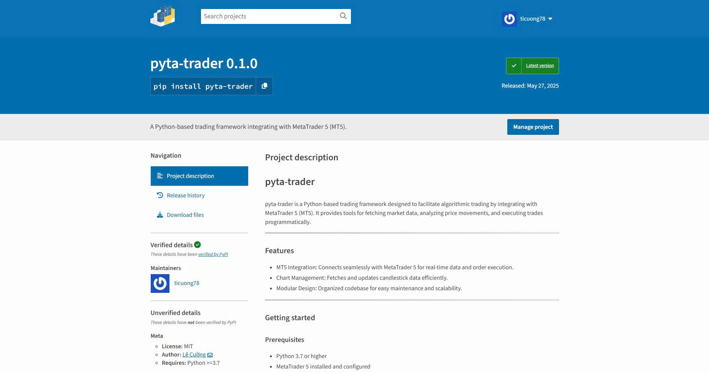

# pyta-trader


[](https://pypi.org/project/pyta-trader/)



`pyta-trader` là bộ công cụ giúp người dùng tái hiện lại các thao tác của nền tảng Meta Trader 5 ngay trên Python

Bộ thư viện này sử dụng mô đun MetaTrader5, một mô đun được cung cấp bởi MetaQuotes, một nhà cung cấp nên tảng giao dịch trực tuyến như Meta Trader 5 hay Lite Finance.

Người phát triển có thể tìm thấy tài liệu về mô đun MetaTrader5 ngay tại đây: [MetaTrader module for integration with Python](https://www.mql5.com/en/docs/python_metatrader5)

---

## Bảng nội dung

- [Giới thiệu](#pyta-trader)
- [Một số tính năng chính](#1-một-số-tính-năng-chính)
- [Cách thức sử dụng](#2-cách-thức-sử-dụng)
  - [Điều kiện nền tảng](#điều-kiện-nền-tảng)
  - [Cấu hình repo](#cấu-hình-repo)
    - [Cấu hình repo (cho lập trình viên)](#nếu-bạn-là-nhà-phát-triển-hay-lập-trình-viên)
    - [Cài đặt từ PyPI (cho người dùng thư viện)](#nếu-bạn-là-người-sử-dụng-thư-viện)
- [Cho lập trình viên](#3-cho-lập-trình-viên)
  - [Cấu hình thư mục](#cấu-hình-thư-mục)
- [Giấy phép](#giấy-phép)

---

## 1. Một số tính năng chính

- `pyta-trader` kết nối trực tiếp với nền tảng Meta Trader 5 ngay trên máy tính của họ, giúp người sử dụng có thể thực hiện các thao tác tương tự như Meta Trader 5.
- `pyta-trader` nhận diện sự thay đổi giá trong thực tế sau đó quản lý và cập nhật thông tin thời gian thực lên biểu đồ.
- `pyta-trader` được thiết kế theo dạng mô đun hóa, giúp lập trình viên dễ dàng sử dụng, phát triển và mở rộng.

---

## 2. Cách thức sử dụng

### Điều kiện nền tảng

- `pyta-trader` yêu cầu lập trình viên phải sử dụng Python từ 3.13 trở lên.
- Vì nền tảng Meta Trader 5 được kết nối trực tiếp với Python thông qua `pyta-trader`, chính vì thế `pyta-trader` hi vọng người dùng hoặc lập trình viên đã cài đặt và cấu hình đầy đủ các phiên bản của nên tảng Meta Trader cung cấp bởi MetaQuotes hoặc các nhà cung cấp xác thực.

### Cấu hình repo

#### Nếu bạn là nhà phát triển hay lập trình viên

Dưới đây là các cài đặt cho bạn

```bash
git clone https://github.com/ticuong78/pyta-trader.git
cd pyta-trader
cp .sample.env .env
```

Sau khi tạo bản sao một repo, bạn nên tạo một bản sau của `.sample.env` và đổi tên bản đó thành `.env` để bắt đầu sử dụng vì Python sử dụng biến môi trường làm nguồn đầu vào cho các dự án không cần giao tiếp với người dùng (không là lập trình viên).

Một số thông tin bạn cần làm rõ trong tệp `.env` như:

```dotenv
APP_ENV=<môi trường của dự án, có thể là "dev" hoặc "product">
MT5_LOGIN=...
MT5_PASSWORD=...
MT5_SERVER=...
MT5_PATH=<đường dẫn đến Meta Trader terminal>
```

Bạn có thể tìm thấy thông tin về Meta Trader terminal tại đây: [Python Integration](https://www.mql5.com/en/docs/python_metatrader5/mt5initialize_py)

#### Nếu bạn là người sử dụng thư viện

Chúng tôi cung cấp cho bạn một mô đun có thể tìm thấy trên PyPi sau: [pyta-trader](https://pypi.org/project/pyta-trader/)

Hoặc

```python
pip install pyta-trader
```

---

## 3. Cho lập trình viên

### Cấu hình thư mục

Dự án được phân chia theo hình thức thư mục sau:

- [project-root](./)
  - [pyta_trader](./src//pyta_trader/)
    Thư mục mã nguồn chính, giúp tách biệt mã chương trình khỏi các tệp cấu hình hoặc tài liệu bên ngoài.
    - [calculations](./src/pyta_trader/calculations/)
    Chứa các phương thức tính toán như SMA, EMA. Smoothings được bỏ vào `smoothings.py`.
    - [chart](./src/pyta_trader/chart/)
    Quản lý giá tiền thông qua lớp biểu đồ, thêm vào đó một lớp để quản lý các biểu đồ.
    - [config](./src/pyta_trader/config/)
    Quản lý biến môi trường và thông số của dự án.
    - [excep](./src/pyta_trader/excep/)
    Chứa các ngoại lệ được mở rộng.
    - [indicator](./src/pyta_trader/indicator/)
    Nơi tập trung các chỉ báo.
    - [infras](./src/pyta_trader/infras/)
    Cơ sở hạ tầng, giao tiếp với nền tẳng MT5, API và cơ sở dữ liệu. Mở rộng tùy theo nhu cầu trong quá trình phát triển.
    - [signals](./src/pyta_trader/signals/)
    Các hàm phân tích thông tin thị trường. Từ indicator có thể đưa ra được các tín hiệu mua/bán.
    - [strategy](./src/pyta_trader/strategy/)
    Chứa các chiến lược phân tích giá thị trường như HA Close hoặc Close, v.v. Mở rộng tùy theo nhu cầu sử dụng trong quá trình phát triển.
  - [tests](./tests/)
  - [docs](./docs/)
  Nơi lưu trữ tài liệu kỹ thuật cũng như hướng dẫn sử dụng thư viện.
  - [README.md](./README.md)
  - [main.py](./main.py)
  Nơi khởi chạy chính của ứng dụng (demo, live trading hoặc backtest)

Số lượng các thư mục và tệp có thể được mở rộng dựa trên nhu cầu sử dụng trong quá trình dự án được phát triển. Đừng ngần ngại clone/fork repo về và bắt đầu tạo ra các commit của riêng bạn.

---

## Giấy phép

Dự án này được cấp phép theo [Creative Commons Attribution-NonCommercial 4.0 International License](https://creativecommons.org/licenses/by-nc/4.0/)
